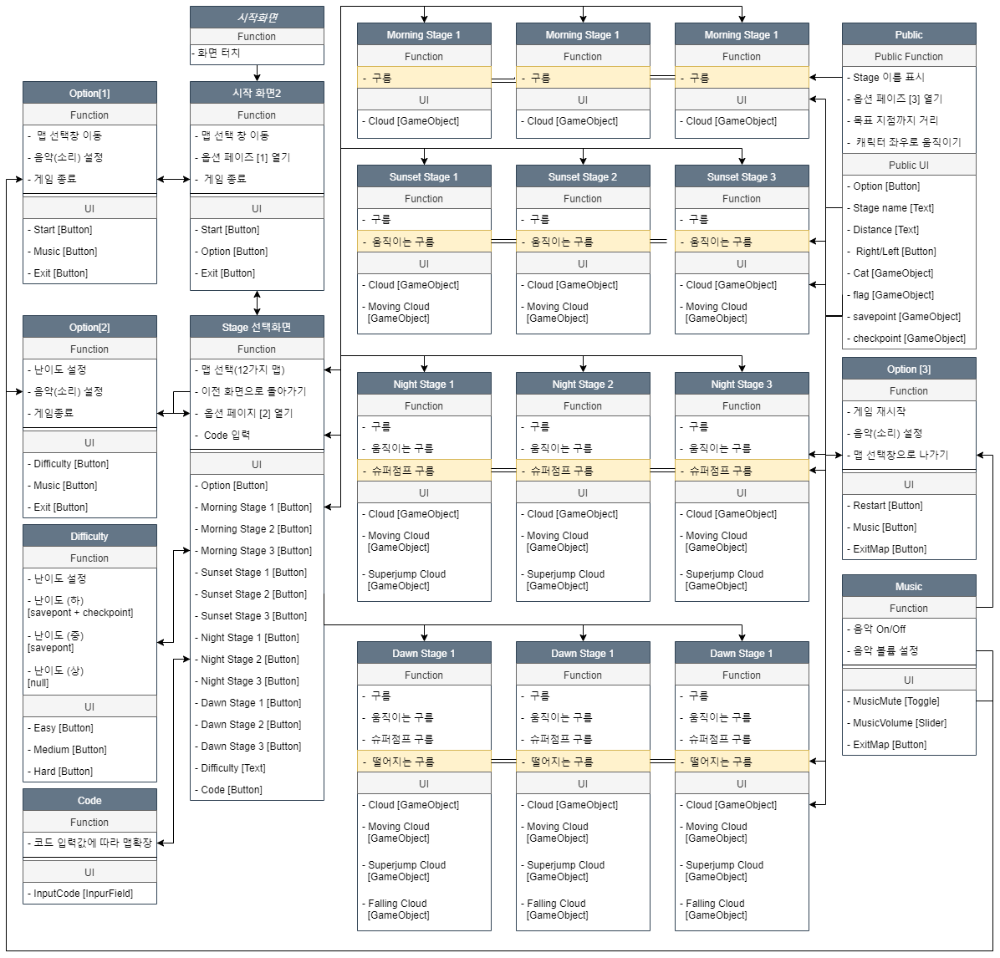

# GrandAdventorOfCat Game Project
### 냥냥이 대모험 게임 프로젝트입니다.

> 게임 이름 : '냥냥이대모험'(GrandAdventorOfCat)

> 개발 환경

 * Game Project : Unity 2018.2.1f1 (64-bit) / Microsoft Visual Studio 2017  
 * Game UI : PhotoShop CC 2018
  
> 개발 언어 : C#
  
> 개발 기간 : 6개월
  
> 개발 동기  

기타무라 마나미 작가님의 <유니티5 교과서>
6장 Physics와 애니메이션에서 예제로 나오는 게임으로서
예제로 나왔던 게임은 그냥 구름을 올라가는 고양이 게임으로 설명되었다.

당시 구름과 고양이 그리고 고양이를 동작시키는 스크립트 밖에 없었던지라 
이를 기점으로 더 많은 기능들을 추가하여 게임을 발전시키고 싶었다.

이로써 Cloud Cat flag UI와 예제에서 나오는 스크립트들을 기준으로 게임을 발전시켰으며
실제로 완성도 높은 게임을 만들기까지 목표를 세우고 잡았다.

> 개발 과정  

* 블로그 개발 과정
https://blog.naver.com/luh5063014/221494765785
  
  * [Unity] 유니티 엔진을 이용한 모바일 게임 만들기 - (1) / 게임 소개 및 기본 개요  
  * [Unity] 유니티 엔진을 이용한 모바일 게임 만들기 - (2) / 게임 세팅(Game Setting)  
  * [Unity] 유니티 엔진을 이용한 모바일 게임 만들기 - (3) / 애니메이션(Animation) 모션 만들기  
  * [Unity] 유니티 엔진을 이용한 모바일 게임 만들기 - (4) / 캐릭터 이동하기 && 애니메이션(Animation) 적용  
  * [Unity] 유니티 엔진을 이용한 모바일 게임 만들기 - (5) / 씬(Scence) 관리와 씬(Scene) 전환  
  * [Unity] 유니티 엔진을 이용한 모바일 게임 만들기 - (6) / 카메라 시점 관리와 UI 기본 작업  
  * [Unity] 유니티 엔진을 이용한 모바일 게임 만들기 - (7) / 스테이즈 선택창 맵 만들기  
  * [Unity] 유니티 엔진을 이용한 모바일 게임 만들기 - (8) / 게임 옵션 창 구현하기  
  * [Unity] 유니티 엔진을 이용한 모바일 게임 만들기 - (9) / 페이드 인(Fade in)&페이드 아웃(Fade out) + 코루틴(Coroutine)  
  * [Unity] 유니티 엔진을 이용한 모바일 게임 만들기 - (10) / 구름 움직이기 및 움직이는 구름 올라타기   
  * [Unity] 유니티 엔진을 이용한 모바일 게임 만들기 - (11) / 슈퍼점프 구름 구현하기  
  * [Unity] 유니티 엔진을 이용한 모바일 게임 만들기 - (12) / 감독 스크립트 만들기 + 간접적 충돌감지  
  * [Unity] 유니티 엔진을 이용한 모바일 게임 만들기 - (13) / BGM(음악) 구현하기  
  * [Unity] 유니티 엔진을 이용한 모바일 게임 만들기 - (14) / 로딩 씬(Loading Scene) 구현하기  
  * [Unity] 유니티 엔진을 이용한 모바일 게임 만들기 - (15) / 체크포인트&세이브포인트(CheckPoint&SavePoint) 구현하기  
  * [Unity] 유니티 엔진을 이용한 모바일 게임 만들기 - (16) / 떨어지는 구름 구현하기  
  * [Unity] 유니티 엔진을 이용한 모바일 게임 만들기 - (17) / 스테이즈 난이도(Stage Difficulty) 설정하기  
  * [Unity] 유니티 엔진을 이용한 모바일 게임 만들기 - (18) / 스테이즈 클리어 기능(Stage Clear Function) 만들기  
  * [Unity] 유니티 엔진을 이용한 모바일 게임 만들기 - (19) / 모바일 용 동작 버튼(Mobile Button) 만들기  
  * [Unity] 유니티 엔진을 이용한 모바일 게임 만들기 - (20) / 게임 완성 및 포토폴리오  

* 게임 개발 구상도

[1] 냥냥이대모험구상도

[2] 냥냥이대모험 스크립트 구성

[3] 냥냥이대모험 구름 기능 구상도

